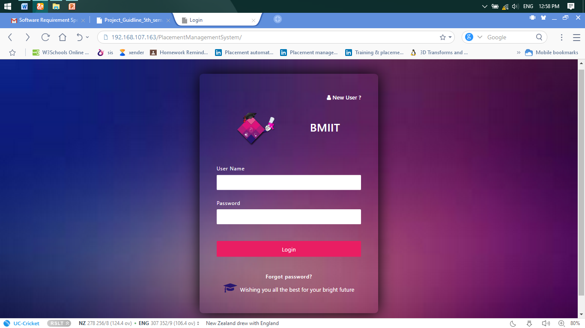

# Placement-Managemanr-System
Placement Management system is used to maintain the placement’s reports and data of the student as well as companies and helps the companies to get connected with students(institute) and vice versa, and  helps placement officer to maintain the records for the institute and can easily get reports of placements whenever required.

